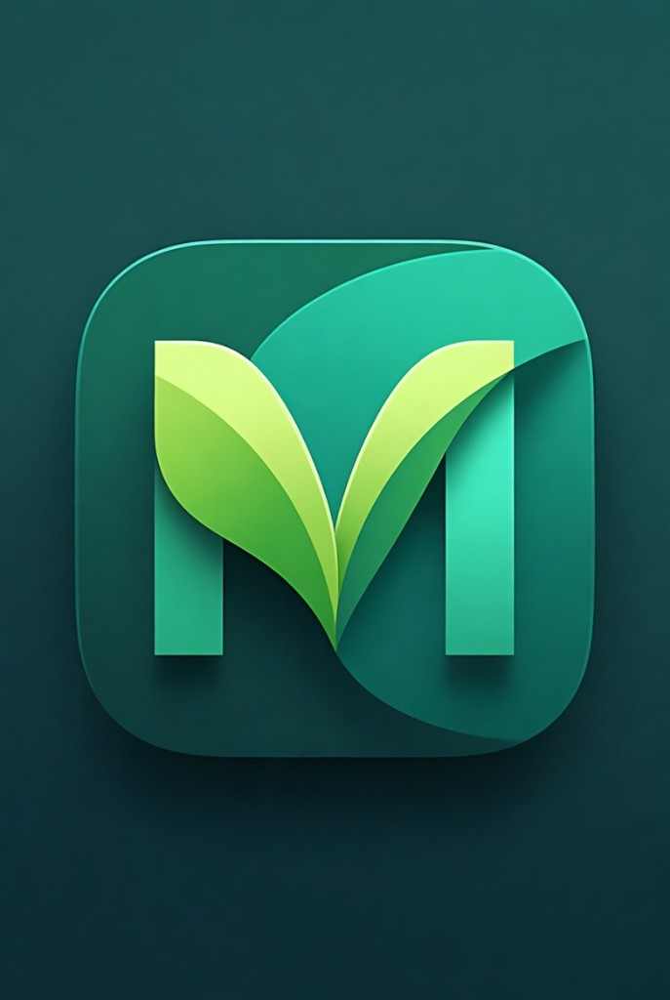
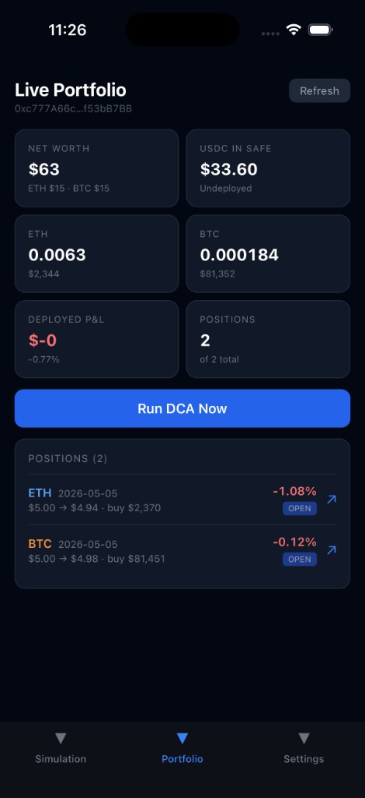
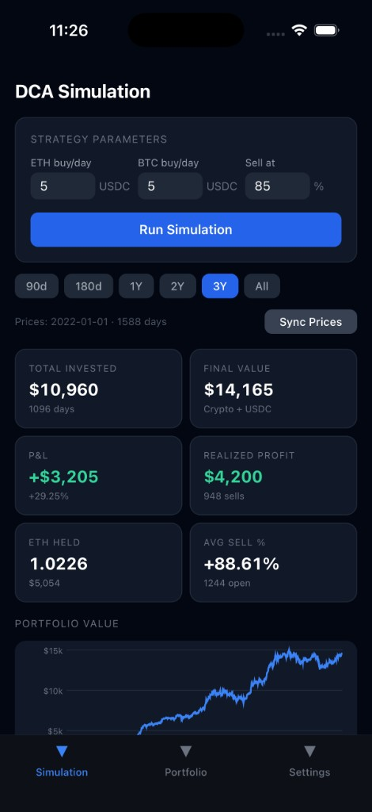

<div align="center">



# MeditFin

**A self-custodial DCA bot for ETH & BTC on Base — controlled entirely from your iPhone.**

[](https://developer.apple.com/ios)
[](https://expo.dev)
[](https://reactnative.dev)
[](https://base.org)

</div>

---

## What is MeditFin?

MeditFin is an iOS app that automates a **Dollar Cost Averaging (DCA)** strategy for ETH and BTC, using a **Safe (Gnosis Safe) multisig** wallet you own on the **Base** L2 network.

The app is fully self-custodial: your funds live in your Safe, the bot key is just a co-signer with no transfer rights of its own. The private key never leaves the iOS **Keychain (Secure Enclave)**.

It also ships with a **historical backtester** so you can tune your strategy against real ETH/BTC prices since 2022 before deploying any capital.

### Highlights

- **Daily DCA on autopilot** — hourly background task buys configurable USDC amounts of ETH and BTC.
- **Auto take-profit** — every position is closed back to USDC when it crosses your profit threshold.
- **Self-custodial via Safe** — the app signs Safe transactions; your multisig holds the funds.
- **On-chain swaps** — uses Uniswap V3 (`SwapRouter02`) on Base, batched through Safe's `MultiSend`.
- **Backtester** — replay strategies on real CoinGecko price history (90 d → all-time).
- **Keys stay on-device** — bot key and CoinGecko Pro key are stored in the iOS Keychain.
- **No backend** — everything runs locally on your iPhone.

---

## Screenshots

<div align="center">

<table>
  <tr>
    <td align="center"><b>Live Portfolio</b></td>
    <td align="center"><b>Strategy Backtester</b></td>
  </tr>
  <tr>
    <td></td>
    <td></td>
  </tr>
</table>

</div>

---

## How it works

```
┌──────────────────┐   reads / signs   ┌──────────────────┐
│   MeditFin app   │ ────────────────► │  Safe (Base L2)  │
│  (iOS, on-device)│                   │  holds USDC/ETH  │
└────────┬─────────┘                   │  /cbBTC funds    │
         │                             └────────┬─────────┘
         │ hourly                               │ executes
         ▼                                      ▼
┌──────────────────┐                   ┌──────────────────┐
│ expo-background- │                   │  Uniswap V3      │
│ task (every ~1h) │                   │  SwapRouter02    │
└────────┬─────────┘                   └──────────────────┘
         │
         ▼
   1. Fetch live ETH/BTC price (Ambire price API)
   2. Close any position above its asset take-profit (`profitThresholdEth` / `profitThresholdBtc`) or stop-loss when enabled (USDC ← asset)
   3. If Safe has enough USDC, buy `dailyAmountEth` ETH + `dailyAmountBtc` BTC
   4. Persist positions in local SQLite
```

### Architecture

| Layer | What it does | Key files |
|---|---|---|
| **UI** | 3-tab Expo Router app: Simulation, Portfolio, Settings | `app/(tabs)/*` |
| **DCA engine** | Pure-function backtester over historical prices | `lib/dca-engine.ts` |
| **DCA runner** | On-chain version of the engine using your Safe + viem | `lib/dca-runner.ts` |
| **Safe layer** | Builds & signs `execTransaction` / `MultiSend` calls | `lib/safe.ts` |
| **Swaps** | Uniswap V3 `exactInputSingle` builders for ETH ↔ USDC and cbBTC ↔ USDC | `lib/swap.ts` |
| **Persistence** | Positions and price cache in expo-sqlite; secrets in Keychain | `lib/db.ts`, `lib/position-store.ts`, `lib/config-store.ts` |
| **Background** | Hourly task that triggers `runDailyDca` | `tasks/dca-task.ts` |

### Strategy parameters

Configure in **Settings**:

- `ETH buy / day` — USDC spent on ETH each day
- `BTC buy / day` — USDC spent on BTC each day
- `Sell at profit %` — close any open position once unrealized PnL ≥ this %
- `Safe Address` — your Gnosis Safe on Base
- `Bot Private Key` — an EOA that is an owner (or co-owner) of the Safe; stored in Keychain
- `RPC URL` — defaults to `https://base.llamarpc.com`
- `CoinGecko Pro Key` — *(optional, for the simulator only)* enables long-range price history

---

## Tech stack

- **Expo SDK 55** + **React Native 0.83** + **React 19**
- **expo-router** (typed routes), **expo-sqlite**, **expo-secure-store**, **expo-background-task**
- **viem** for all on-chain interaction
- **react-native-reanimated 4** + **react-native-svg** for the charts
- Targets **Base** mainnet (chainId `8453`)

---

## Getting started

### Prerequisites

- macOS with **Xcode 16+** ([App Store](https://apps.apple.com/app/xcode/id497799835))
- **Node 20+** and **npm**
- **CocoaPods** (`brew install cocoapods`)
- An iPhone (for sideloading) **or** an iOS Simulator runtime installed via Xcode → Settings → Platforms
- A free Apple ID (for sideloading on a real device)

### 1. Install dependencies

```bash
git clone <your-repo-url> dca-safe-bot-mobile
cd dca-safe-bot-mobile
npm install --legacy-peer-deps
```

> `--legacy-peer-deps` is required because `react-dom` (a transitive peer of `expo-router`) tries to pull a newer `react` than Expo SDK 55 pins.

### 2. Run on the iOS Simulator

```bash
npm run ios
# or:  npx expo run:ios
```

This generates the native `ios/` project, runs `pod install`, builds, and launches the simulator.

### 3. Run on a real iPhone

Plug the device in via USB, then:

```bash
npm run ios-device
# or:  npx expo run:ios --device
```

For a full walk-through of free 7-day sideloading and AltStore-based auto-refresh, see **[docs/sideloading.md](docs/sideloading.md)**.

### 4. Configure the bot (in-app)

Open the **Settings** tab and fill in:

1. **Safe Address** — your Gnosis Safe deployed on Base.
2. **Bot Private Key** — an EOA that's an owner of the Safe (use a **dedicated** key with no other funds).
3. **RPC URL** — keep the default or paste your Alchemy/Infura URL.
4. **DCA Strategy** — daily USDC amounts and sell-at-profit %.
5. **Background Bot** — toggle on once you've verified the Safe.

Tap **Verify Safe on-chain** to confirm the app can read your Safe's owners and threshold before enabling the bot.

---

## Project structure

```
.
├── app/                  # expo-router screens
│   ├── _layout.tsx
│   └── (tabs)/
│       ├── index.tsx     # Simulation
│       ├── portfolio.tsx # Live portfolio
│       └── settings.tsx
├── components/           # LineChart, StatCard
├── lib/
│   ├── dca-engine.ts     # Pure backtester
│   ├── dca-runner.ts     # On-chain executor
│   ├── safe.ts           # Safe execTransaction + MultiSend
│   ├── swap.ts           # Uniswap V3 routes
│   ├── position-store.ts # SQLite CRUD for positions
│   ├── price-store.ts    # CoinGecko price cache
│   ├── config-store.ts   # SecureStore + Keychain
│   ├── constants.ts      # Addresses, ABIs, RPC defaults
│   └── db.ts             # SQLite bootstrap
├── tasks/
│   └── dca-task.ts       # expo-background-task registration
├── docs/
│   └── sideloading.md
└── assets/readme/        # README screenshots & logo
```

---

## Scripts

| Command | What it does |
|---|---|
| `npm start` | Start the Expo dev server (Metro) |
| `npm run ios` | Build & run on iOS Simulator |
| `npm run ios-device` | Build & run on a connected iPhone |
| `npm run ios-install-pod` | `pod install` inside `ios/` |
| `npm run build` | EAS build for iOS (requires `eas login`) |

---

## Security notes

- **Disclaimer:** This product was **vibe coded** (AI-assisted, iterative development). It is offered **without warranty** of any kind and **as-is**. Do not deploy capital you cannot afford to lose; audit and test yourself before mainnet use.
- The **bot key is a Safe co-owner**, not the only owner. Use a multi-owner / threshold setup so a compromised iPhone can't drain your funds.
- The bot key is written to `expo-secure-store`, which on iOS maps to the **Keychain** (Secure Enclave-backed when available). It is never logged, exported, or sent off-device.
- Free Apple ID provisioning expires every **7 days** — see the sideloading guide for refresh strategies.
- This project is **experimental software**. Audit the code before deploying any non-trivial capital.

---

## Roadmap ideas

- [ ] Android target
- [ ] Push notifications on each DCA run
- [ ] Multiple strategies / per-asset profit thresholds
- [ ] On-chain trade history view with Basescan deep-links
- [ ] WalletConnect-based co-signer flow (so the bot key never touches the device)

---

## License

MIT — see [`LICENSE`](LICENSE).
